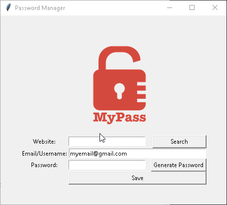

# 🔑 Password Manager

A simple password manager built with Python and Tkinter that allows you to generate and store secure passwords efficiently.

## 📌 Features
- Generate strong passwords with a mix of letters, numbers, and symbols.
- Save passwords securely in a JSON file.
- Search for saved credentials quickly.
- Copy passwords directly to clipboard.
- User-friendly interface with Tkinter.

## 🚀 How to Use
1. Run the script: `python main.py`
2. Enter a website name.
3. Enter your email or username.
4. Click "Generate Password" to create a secure password.
5. Click "Save" to store your credentials in `data.json` file.
6. Use the "Search" button to find the stored credentials.

## ⚙️ Requirements
- Python 3.x
- `pyperclip` (install with `pip install pyperclip`)

## 🎥 Demo

## 🛠 Technologies Used
- Python
- Tkinter 
- Pyperclip
- JSON

## 👨‍💻 Created by [Tsaousidis](https://github.com/Tsaousidis)
🎉 Have fun using the password manager! Let me know your thoughts and suggestions! 🎉

